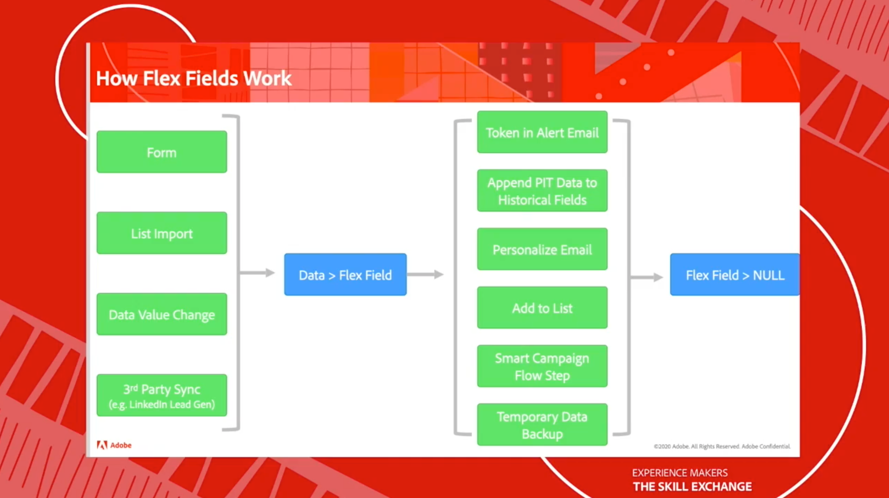
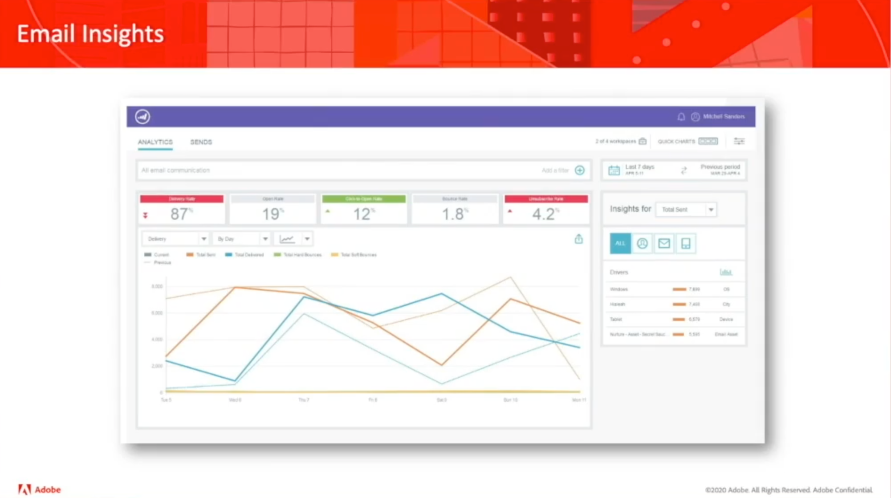
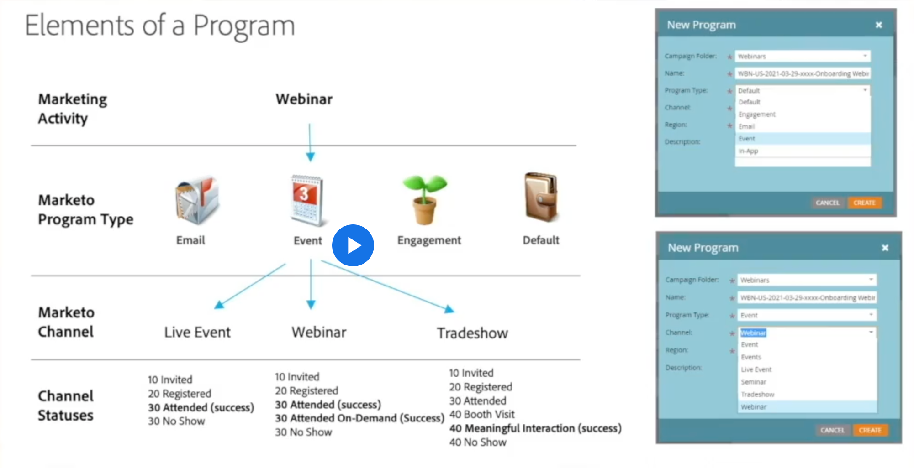

# The Skill Exchange {#overview}

Experience Makers The Skill Exchange is a global series of virtual customer learning events, focusing on diving deeper into Adobe Experience Cloud solutions. This program provides opportunity to learn from Adobe product experts and expert peers through sharing of best practices and tips & tricks.

>[!TIP]
>
>**All recorded sessions are listed in the navigation on the left**.

## Featured Sessions

<table>
  <tr>
   <td>
      
      

         <a href="/help/events/marketo2021/rockstar.md"><strong>Adobe Marketo Engage Rockstar Segment</strong></a>
<!----          <em>foo</em> --->
      

      

         
         Four "Rockstar" customers will each present their best Marketo Engage tip or trick. Who will dazzle you beyond belief?
      

    </td>
   <td>
      
      

         <a href="/help/events/marketo2021/reporting.md"><strong>Reporting within Marketo Engage</strong></a>
<!----          <em>foo</em> --->
      

      

         
         You will leave this session with an understanding of high level reporting capabilities within Marketo Engage, and a deep dive into Reports and Smart Lists.
      

    </td>
   <td>
      
      

         <a href="/help/events/marketo2021/create-programs.md"><strong>Creating Programs Within Adobe Marketo Engage</strong></a>
<!----          <em>foo</em> --->
      

      

         
         Learn about Program Structure, Program Types, Channels, Statuses and Tags.
      

    </td>
  </tr>
</table>
